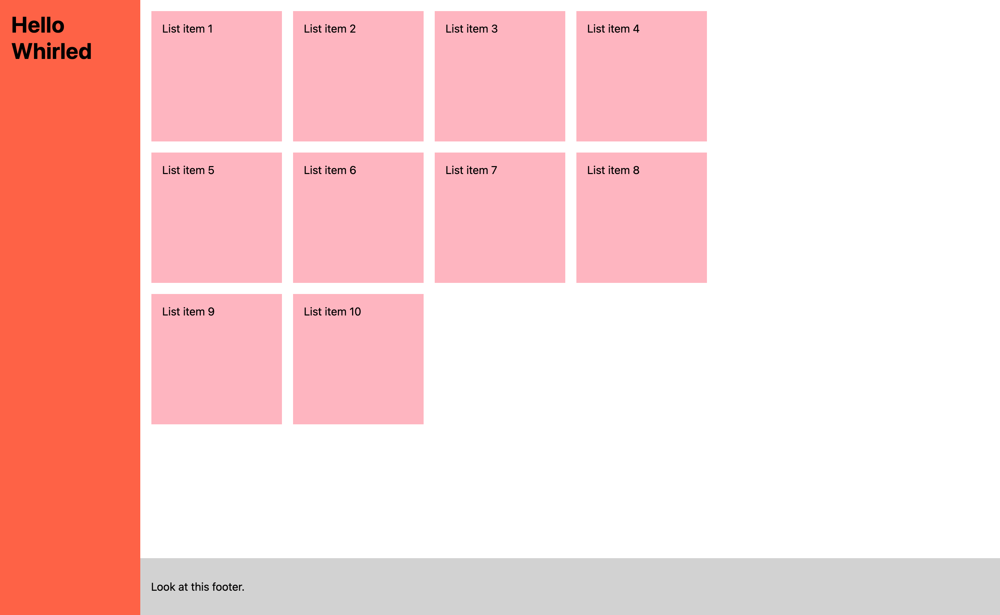

# Front-end Layout Test

This coding test is about your ability to turn some markup into a responsive HTML document that works across all viewport widths.

Your task is to take the _narrow_ and _wide_ design images from the `designs` folder and turn them into code. There’s also a video to show the behaviour.

Spend no more than an hour on the test. If in doubt about anything just make a decision or make a note to discuss later.

Feel free to write comments that demonstrate your knowledge and can act as talking points in the interview.

Use modern layout techniques and don’t worry about legacy browser compatibility or vendor prefixes - though we may ask about this in the interview, so keep it in mind.

Don't worry about specifics of padding and margin and such things, decide on some sensible numbers. Feel free to add class names if you like.

## Dev

There’s a `package.json` file included.

Run `npm install`, then `npm start`.

[Browsersync](https://browsersync.io/) will start up a server on `http://localhost:3000/` and watch the `src/` folder files for changes. If you have a preferred environment feel free to change as you see fit.

## When you're done

Send us your project (make sure to remove the node_modules folder). Push it to a git repository somewhere, a "cloud" folder, or even send it via email.

## Designs

From the `designs` folder:

## Video:

See `designs/fe-test.mp4`.

### Narrow Viewport:

### Mid Viewport:

### Wide Viewport:

